# libxev-go

> **🚧 Work in Progress**: This library is under active development. APIs may change.

Go bindings for [libxev](https://github.com/mitchellh/libxev), a high-performance event loop library written in Zig.

## Features

- **Pure Go**: No cgo required. Uses [JupiterRider/ffi](https://github.com/JupiterRider/ffi) (libffi) for FFI calls.
- **Cross-platform**: Supports macOS (kqueue), Linux (io_uring), and Windows (IOCP).
- **Async I/O**: High-performance file operations with thread pool backing for blocking operations.
- **Two API levels**:
  - `cxev`: Low-level FFI bindings matching libxev's C API
  - `xev`: High-level Go-idiomatic API with `time.Duration`, error handling, and callbacks

## Architecture

```mermaid
flowchart TD
    A["🚀 Your Application"]
    B["📦 xev<br/><small>High-level Go API</small><br/><small><i>pkg/xev/</i></small>"]
    C["⚙️ cxev<br/><small>Low-level FFI bindings</small><br/><small><i>pkg/cxev/</i></small>"]
    D["🔗 libffi<br/><small>C calling convention</small><br/><small><i>github.com/jupiterrider/ffi</i></small>"]
    E["⚡ libxev<br/><small>Zig event loop</small><br/><small><i>deps/libxev/</i></small>"]

    A ==> B
    B ==> C
    C ==> D
    D ==> E

    style A fill:#f0f4ff,stroke:#5e72e4,stroke-width:2px
    style B fill:#e3f2fd,stroke:#2196f3,stroke-width:2px
    style C fill:#e8f5e9,stroke:#4caf50,stroke-width:2px
    style D fill:#fff3e0,stroke:#ff9800,stroke-width:2px
    style E fill:#fce4ec,stroke:#e91e63,stroke-width:2px
```



## Quick Start

```go
package main

import (
    "fmt"
    "os"

    "github.com/crrow/libxev-go/pkg/xev"
)

func main() {
    // Create event loop
    loop, err := xev.NewLoop()
    if err != nil {
        panic(err)
    }
    defer loop.Close()

    // Open file for async read
    file, err := xev.OpenFile("example.txt", os.O_RDONLY, 0)
    if err != nil {
        panic(err)
    }
    defer file.Close()

    // Prepare buffer for reading
    buf := make([]byte, 1024)

    // Async read with callback
    file.ReadFunc(loop, buf, 0, func(f *xev.File, buf []byte, n int, err error) xev.Action {
        if err != nil {
            fmt.Printf("Read error: %v\n", err)
            return xev.Disarm
        }
        fmt.Printf("Read %d bytes: %s\n", n, string(buf[:n]))
        return xev.Disarm
    })

    // Run the event loop
    loop.Run()
}
```

## Examples

See [examples/concurrent_copy](examples/concurrent_copy) for a complete benchmark comparing libxev async I/O vs goroutine-based blocking I/O for concurrent file operations.

```bash
just build-extended
just example-concurrent-copy
```

## Building

### Prerequisites

- Go 1.25+
- [Zig](https://ziglang.org/) 0.15.1+ (for building libxev)

## License

MIT License - see [LICENSE](LICENSE) for details.

Based on [libxev](https://github.com/Hejsil/libxev) by Mitchell Hashimoto.
